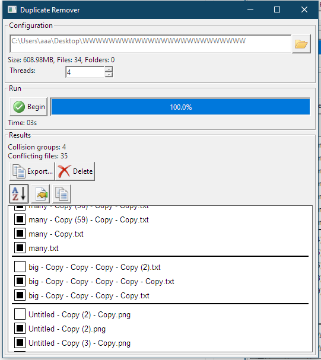

# Duplicate Remover

### Find and remove duplicate files efficiently

## Features

- Extremely fast scanning through use of parallelism and scheduling algorithms
- Fast file hashing using xxhash and pre-hashing mechanisms
- Efficient and native GUI powered by the [IUP](https://www.tecgraf.puc-rio.br/iup/en/) library
- Easily mark files for deletion
- Delete files quickly (permanently or moving them to Trash)
- Export scanning results to JSON

## Benchmarks

### Test 1

| Size (GB) | Number of folders | Number of files | Contents
| - | - | - | - |
| 147,48 GB | 22 | 20062 | Images and videos |

- Tested on Windows 10, 22H2 
- Data stored on an _ST1000DM010-2EP102_ HDD
- Parallelism enabled
- Fastest hash function available for each tool
- Pre-hashing turned on if available
- Scan time measured only

| Tool | Warmness | Time elapsed |
|-|-|-|
| **Duplicate Remover** | warm | 0:46 |
| **Duplicate Remover** | cold | 1:36 |
| [Duplicate Cleaner 5 Pro](https://www.duplicatecleaner.com/) | hot | 1:50
| Duplicate Cleaner 5 Pro | cold | 2:12

---

(*) Benchmarks were not thoroughly tested

## License

This repository is licensed under BSD 2-Clause license.
See `LICENSE` for more info.