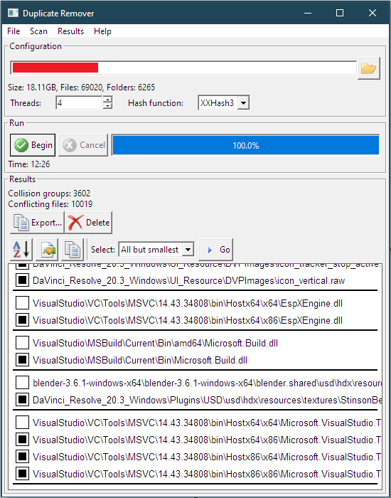

# Duplicate Remover - GUI and CLI tool for removing duplicate files




```sh
USAGE: duplicate-remover [--help] [<command>] [<options...>] [-- [<application arguments...>]]

Find and remove duplicate files

Duplicate remover scans a directory for identical files based
on their hash. You must either pass export or removal arguments.
Both work on selected files which are a subset of duplicates
chosen through the selection strategy (--select).
Depending on the export type, you may pass additional settings,
like --export-json-quick-include which is supported by the JSON
exporter.
You may delete files permanently (--delete) or move them to the
Trash (--trash) if suported.


Options
=======

  -sel   --select                      Selection mode
                                       Supported values: except-largest, except-smallest, largest, smallest, all, none, 
  -d     --dir                         Directory to scan
         --export-file                 Export desination
         --delete                      Remove selected duplicates permanently
         --help                        Show this help menu
         --trash                       Move select deuplicates to trash
  -w     --workers                     Number of workers
         --export-type                 Type of export
                                       Supported values: JSON, JSON Simple, XML, CSV
         --export-json-quick-include   (JSON export) Explicitly add list of files from each group
                                       Supported values: none, largest, smallest, except-largest, except-smallest
```

## Features

- Extremely fast scanning through use of parallelism and scheduling algorithms
- Fast file hashing using xxhash and pre-hashing mechanisms
- Efficient and native GUI powered by the [IUP](https://www.tecgraf.puc-rio.br/iup/en/) library
- Easily mark files for deletion
- Delete files quickly (permanently or moving them to Trash)
- Export scanning results to JSON

## Download

Download duplicate-remover [here](https://github.com/magley/duplicate-remover/releases).

## Benchmarks

### Test 1

| Size (GB) | Number of folders | Number of files | Contents | Collision groups | Colliding files
| - | - | - | - | - | - |
| 147,48 GB | 22 | 20062 | Images and videos | 2079 | 4166 |

- Tested on Windows 10, 22H2 
- Data stored on an _ST1000DM010-2EP102_ HDD
- Parallelism enabled
- Fastest hash function available for each tool
- Pre-hashing turned on if available
- Scan time measured only

| Tool | Warmness | Time elapsed |
|-|-|-|
| **Duplicate Remover** | warm | 0:46 |
| **Duplicate Remover** | cold | 1:36 |
| [Duplicate Cleaner 5 Pro](https://www.duplicatecleaner.com/) | warm | 1:50
| Duplicate Cleaner 5 Pro | cold | 2:12

---

(*) Benchmarks were not thoroughly tested

## License

This repository is licensed under BSD 2-Clause license.
See `LICENSE` for more info.